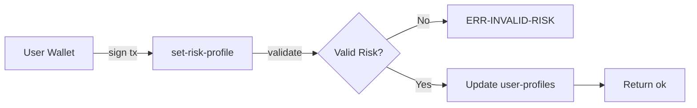
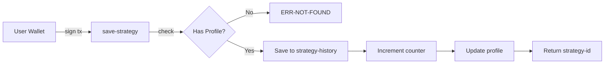

## Overview

The Staxiq smart contract architecture is built on **Clarity**, a decidable smart contract language designed for security and predictability on the Stacks blockchain.

## Contract Structure

The `staxiq-user-profile` contract is organized into distinct sections:

```clarity contracts/staxiq-user-profile.clar
;; Staxiq User Profile Contract
;; Stores user risk profiles and AI strategy history on-chain
;; Built on Stacks Bitcoin L2

;; CONSTANTS - Error codes and risk levels
;; DATA STORAGE - Maps for profiles and strategies
;; PRIVATE FUNCTIONS - Internal validation logic
;; PUBLIC FUNCTIONS - User-facing write operations
;; READ-ONLY FUNCTIONS - Gas-free data queries
```

## Constants

The contract defines constants for error handling and risk level validation:

```clarity contracts/staxiq-user-profile.clar
(define-constant CONTRACT-OWNER tx-sender)
(define-constant ERR-NOT-FOUND (err u404))
(define-constant ERR-INVALID-RISK (err u400))
(define-constant ERR-UNAUTHORIZED (err u401))

;; Valid risk profiles
(define-constant RISK-CONSERVATIVE u1)
(define-constant RISK-BALANCED u2)
(define-constant RISK-AGGRESSIVE u3)
```

### Error Codes

| Code | Constant | Description |
|------|----------|-------------|
| `u404` | `ERR-NOT-FOUND` | User profile or strategy does not exist |
| `u400` | `ERR-INVALID-RISK` | Invalid risk level provided (must be 1, 2, or 3) |
| `u401` | `ERR-UNAUTHORIZED` | Unauthorized access attempt |

### Risk Levels

| Value | Constant | Description |
|-------|----------|-------------|
| `u1` | `RISK-CONSERVATIVE` | Low-risk, stable strategies |
| `u2` | `RISK-BALANCED` | Moderate risk/reward balance |
| `u3` | `RISK-AGGRESSIVE` | High-risk, high-reward strategies |

## Data Maps

The contract uses three primary data maps for storage:

### 1. User Profiles Map

Stores core user profile information:

```clarity contracts/staxiq-user-profile.clar
(define-map user-profiles
  principal
  {
    risk-level: uint,
    created-at: uint,
    updated-at: uint,
    strategy-count: uint
  }
)
```

<ResponseField name="user-profiles" type="map">
  Maps wallet address (principal) to user profile data
  
  <Expandable title="Profile Structure">
    <ResponseField name="risk-level" type="uint" required>
      Risk preference: 1 (Conservative), 2 (Balanced), or 3 (Aggressive)
    </ResponseField>
    <ResponseField name="created-at" type="uint" required>
      Block height when profile was first created
    </ResponseField>
    <ResponseField name="updated-at" type="uint" required>
      Block height of last profile update
    </ResponseField>
    <ResponseField name="strategy-count" type="uint" required>
      Total number of strategies saved for this user
    </ResponseField>
  </Expandable>
</ResponseField>

### 2. Strategy History Map

Stores AI-generated strategy recommendations:

```clarity contracts/staxiq-user-profile.clar
(define-map strategy-history
  { user: principal, strategy-id: uint }
  {
    risk-level: uint,
    strategy-hash: (string-ascii 64),
    protocol: (string-ascii 32),
    timestamp: uint
  }
)
```

<ResponseField name="strategy-history" type="map">
  Maps (user address, strategy ID) tuple to strategy details
  
  <Expandable title="Strategy Structure">
    <ResponseField name="risk-level" type="uint" required>
      Risk level at time of strategy generation
    </ResponseField>
    <ResponseField name="strategy-hash" type="string-ascii" maxLength="64" required>
      Cryptographic hash of the strategy details
    </ResponseField>
    <ResponseField name="protocol" type="string" maxLength="32" required>
      DeFi protocol name (e.g., "ALEX", "Velar", "StackSwap")
    </ResponseField>
    <ResponseField name="timestamp" type="uint" required>
      Block height when strategy was saved
    </ResponseField>
  </Expandable>
</ResponseField>

### 3. User Strategy Count Map

Tracks the total number of strategies per user:

```clarity contracts/staxiq-user-profile.clar
(define-map user-strategy-count
  principal
  uint
)
```

This map provides O(1) lookup for strategy counts without iterating through all strategies.

## Design Decisions

### Clarity Language Benefits

<CardGroup cols={2}>
  <Card title="Decidability" icon="check-circle">
    Clarity is decidable, meaning you can know precisely what a program will do before execution
  </Card>
  <Card title="No Reentrancy" icon="shield">
    Built-in protection against reentrancy attacks that plague Solidity contracts
  </Card>
  <Card title="Post-Conditions" icon="clipboard-check">
    Users can specify conditions that must be met for a transaction to succeed
  </Card>
  <Card title="Bitcoin Finality" icon="bitcoin">
    Stacks settles to Bitcoin, inheriting Bitcoin's security model
  </Card>
</CardGroup>

### Architecture Principles

#### 1. User Sovereignty
All data is keyed by wallet address (`principal`). Users have complete control over their profiles without admin intervention.

```clarity contracts/staxiq-user-profile.clar
;; No admin functions - users own their data
(define-public (set-risk-profile (risk-level uint))
  (begin
    ;; tx-sender is the authenticated user
    (map-set user-profiles tx-sender {
      risk-level: risk-level,
      ;; ...
    })
  )
)
```

#### 2. Immutable History
Once a strategy is saved on-chain, it cannot be modified or deleted. This creates an audit trail.

#### 3. Gas Optimization
Read-only functions are free to call, encouraging data transparency without cost barriers.

#### 4. Validation First
All inputs are validated before state changes occur:

```clarity contracts/staxiq-user-profile.clar
(define-private (is-valid-risk-level (level uint))
  (or
    (is-eq level RISK-CONSERVATIVE)
    (is-eq level RISK-BALANCED)
    (is-eq level RISK-AGGRESSIVE)
  )
)
```

## Data Flow

### Setting Risk Profile



### Saving Strategy



## Block Heights as Timestamps

Clarity uses **block heights** instead of Unix timestamps:

```clarity
;; Current block height
burn-block-height

;; Example: profile created at block 150,000
{ created-at: u150000, updated-at: u150000 }
```

<Note>
  Stacks blocks are produced approximately every 10 minutes (tied to Bitcoin blocks). To convert to approximate time:
  
  `Time = (block_height_diff × 10 minutes)`
</Note>

## Security Considerations

### Authentication
All public functions authenticate using `tx-sender`, which is automatically set to the transaction signer:

```clarity
;; tx-sender is cryptographically verified
(map-set user-profiles tx-sender { ... })
```

### Input Validation
All inputs are validated before state changes:

- Risk levels must be 1, 2, or 3
- String lengths are constrained (64 chars for hash, 32 for protocol)
- Profile existence is checked before saving strategies

### No Privileged Functions
The contract has no admin functions that could modify or delete user data after deployment.

## Upgradeability

<Warning>
  Clarity contracts are **immutable** after deployment. There is no upgrade mechanism. This is a security feature that ensures users know exactly what code they're interacting with.
  
  Any contract changes require deploying a new contract and migrating users.
</Warning>

## Next Steps

<CardGroup cols={2}>
  <Card title="User Profile Functions" icon="function" href="/contracts/user-profile/functions">
    Explore all available contract functions
  </Card>
  <Card title="Integration Guide" icon="code" href="/contracts/user-profile/integration">
    Learn how to call contracts from your app
  </Card>
</CardGroup>